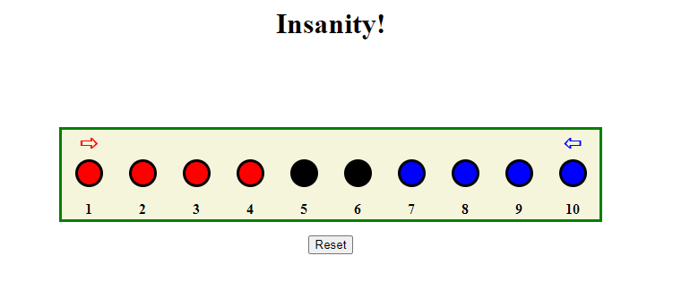

# Insanity

## Background
This project is a recreation of an interesting puzzle, which I found by chance at a flea market. It was one of seven games included in a box titled "Brain busting 7 game set!" by Nifty. I think the game itself is far older than collection, and may be of folk origin.

## Game Pieces
The puzzle consists of a small wooden board with 10 holes in it, and 8 pegs (4 blue and 4 red).

## Rules
This is a single-player game. The 4 red pegs are placed in the leftmost holes, and the 4 blue pegs in the rightmost holes. 
The goal is to switch the colors; in other words, to move all the red pegs to the rightmost holes and the blue pegs to leftmost holes.
Legal moves are moving a peg forwards one space, or jumping forwards over a peg. You can never move a peg backwards, i.e., in the direction of where it started.
